# Aplicaciones Distribuidas

# Planificación de la Semana 3

## MicroPedidos, Seguridad JWT, Docker, Postman y Docker Hub

**Carrera:** Desarrollo de Software
**Asignatura:** Aplicaciones Distribuidas
**Unidad:** Unidad 2 – Desarrollo, seguridad y despliegue de microservicios
**Semana:** 3
**Proyecto integrador:** MicroClientes + MicroPedidos

---

# 1. Tema de la semana

Durante la Semana 3 se completará el funcionamiento del microservicio **MicroPedidos**, incorporando el registro de pedidos, el cálculo automático del total y la publicación del evento `pedidoRegistradoEvent`.

Además, se implementarán pruebas de seguridad con JWT, se dockerizarán los microservicios MicroClientes y MicroPedidos, se configurarán ambientes en Postman y se publicarán las imágenes de ambos proyectos en Docker Hub.

---

# 2. Objetivo de aprendizaje

Implementar, proteger, probar, contenerizar y publicar los microservicios MicroClientes y MicroPedidos, aplicando comunicación asíncrona con RabbitMQ, autenticación JWT, Docker, Postman y Docker Hub dentro del proyecto integrador.

---

# 3. Resultado general esperado

Al finalizar la semana, el estudiante deberá disponer de la siguiente arquitectura funcional:

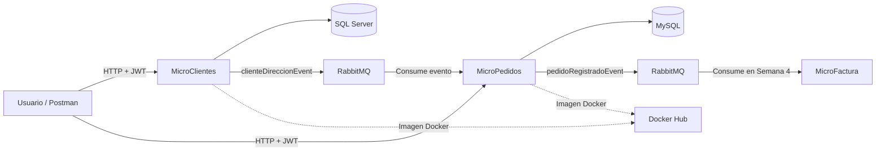

---

# 4. Microservicios trabajados

| Microservicio | Tecnología   | Base de datos | Responsabilidad                                                                             |
| ------------- | ------------ | ------------- | ------------------------------------------------------------------------------------------- |
| MicroClientes | ASP.NET Core | SQL Server    | Administrar clientes y direcciones; publicar `clienteDireccionEvent`.                       |
| MicroPedidos  | FastAPI      | MySQL         | Consumir clientes, registrar pedidos, calcular el total y publicar `pedidoRegistradoEvent`. |
| MicroFactura  | Spring Boot  | PostgreSQL    | Consumirá `pedidoRegistradoEvent` en la Semana 4.                                           |

---

# 5. Bloque 1 – Repaso de la integración MicroClientes y MicroPedidos

## 5.1 Objetivo

Verificar que MicroClientes publique correctamente el evento `clienteDireccionEvent` y que el Worker de MicroPedidos lo consuma y almacene en MySQL.

## 5.2 Flujo de entrada hacia MicroPedidos

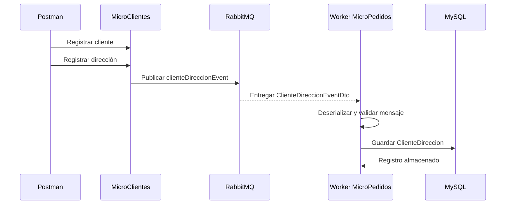

## 5.3 Información recibida

MicroPedidos recibe un objeto resumido con los datos necesarios del cliente:

```json
{
  "clienteId": 15,
  "nombreCompleto": "Carlos Pérez",
  "email": "carlos@email.com",
  "direccionCompleta": "Av. Amazonas N34-120 y Naciones Unidas"
}
```

## 5.4 Conceptos que debe comprender el estudiante

* Productor o Publisher.
* Consumidor o Subscriber.
* Evento.
* DTO de evento.
* Cola.
* Exchange.
* Routing Key.
* Worker.
* Comunicación asíncrona.
* Persistencia local de información externa.
* Base de datos independiente por microservicio.

---

# 6. Bloque 2 – Registro de pedidos en MicroPedidos

## 6.1 Objetivo

Implementar el CRUD de pedidos y relacionar cada pedido con la información de cliente y dirección recibida desde MicroClientes.

## 6.2 Entidad Pedido

La entidad puede contener los siguientes campos:

```text
PedidoId
ClienteDireccionId
Descripcion
Producto
Cantidad
PrecioUnitario
Total
Estado
FechaPedido
```

## 6.3 Operación principal

Al registrar un pedido, MicroPedidos debe:

1. Validar que el cliente y la dirección existan localmente.
2. Recibir el producto, cantidad y precio unitario.
3. Calcular automáticamente el total.
4. Guardar el pedido en MySQL.
5. Construir un único DTO con el pedido, cliente y dirección.
6. Publicar el evento `pedidoRegistradoEvent`.

## 6.4 Cálculo del total

```text
Total = Cantidad × PrecioUnitario
```

El cliente HTTP no debe enviar el total calculado como valor definitivo. El total debe ser calculado por el servicio para evitar inconsistencias.

## 6.5 Flujo interno para registrar el pedido

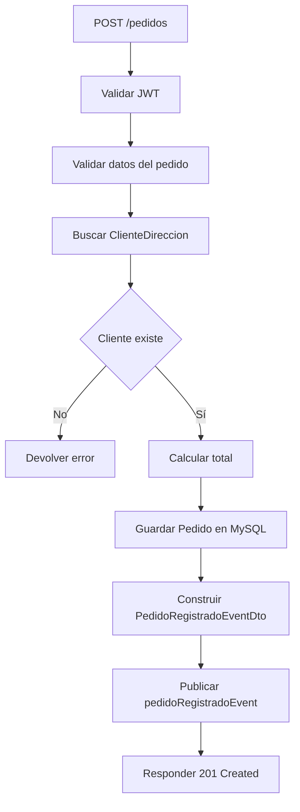

---

# 7. Bloque 3 – Evento pedidoRegistradoEvent

## 7.1 Objetivo

Publicar un único objeto que contenga los datos del pedido, cliente y dirección, para que MicroFactura tenga toda la información necesaria sin consultar otras bases de datos.

## 7.2 DTO recomendado

```json
{
  "pedidoId": 1001,
  "clienteId": 15,
  "nombreCliente": "Carlos Pérez",
  "email": "carlos@email.com",
  "direccionEntrega": "Av. Amazonas N34-120 y Naciones Unidas",
  "producto": "Laptop Lenovo",
  "cantidad": 1,
  "precioUnitario": 850.00,
  "total": 850.00,
  "estado": "REGISTRADO",
  "fechaPedido": "2026-07-21T20:30:00"
}
```

## 7.3 Flujo del evento hacia MicroFactura

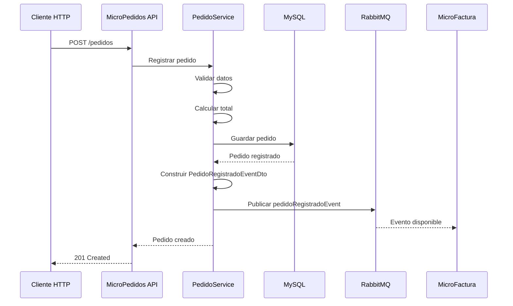

## 7.4 Responsabilidad de MicroFactura

En esta semana únicamente se publica el evento.

En la Semana 4, MicroFactura:

* Consumirá `pedidoRegistradoEvent`.
* Guardará una copia local del pedido.
* Generará la factura.
* Calculará subtotal, IVA y total.
* Administrará el CRUD de facturas.

---

# 8. Bloque 4 – Seguridad JWT en MicroPedidos

La seguridad actual del proyecto MicroPedidos utiliza un endpoint `/login`, generación de tokens con HS256 y una dependencia `JWTBearerToken` para proteger rutas. Actualmente se encuentran protegidos `GET /pedidos` y `POST /pedidos`; los demás endpoints requieren que se agregue la dependencia o que se configure la protección a nivel del router.

## 8.1 Objetivo

Comprender el flujo de autenticación y autorización mediante JWT y validar los endpoints protegidos desde Swagger y Postman.

## 8.2 Flujo de seguridad

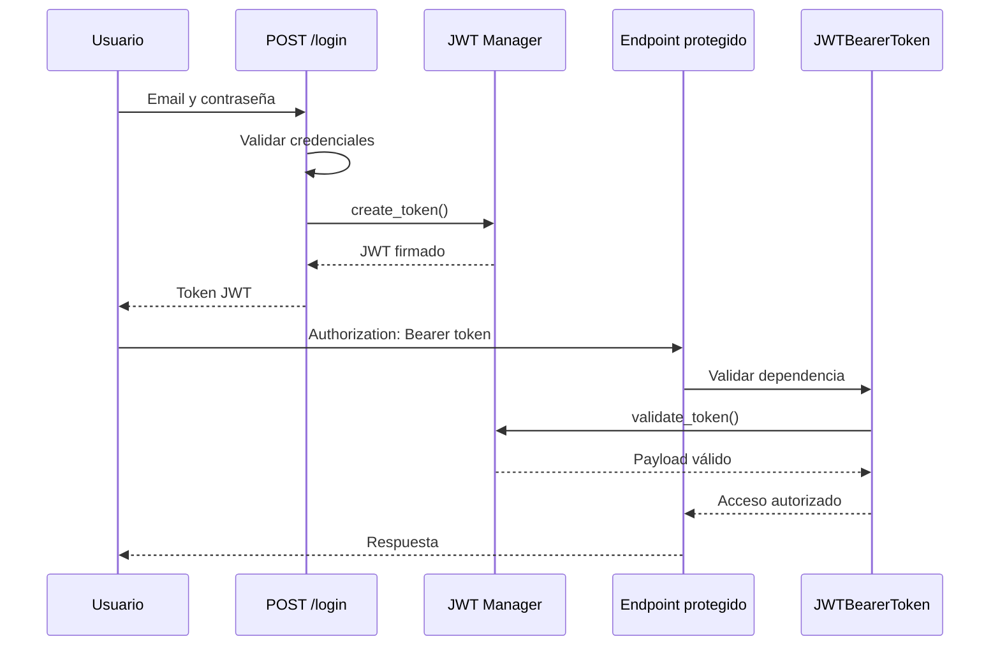

## 8.3 Endpoint de autenticación

```http
POST /login
```

Solicitud:

```json
{
  "email": "admin@gmail.com",
  "password": "admin"
}
```

## 8.4 Encabezado para endpoints protegidos

```http
Authorization: Bearer <token>
```

## 8.5 Prácticas de seguridad

El estudiante deberá realizar las siguientes pruebas:

| Prueba                             | Resultado esperado |
| ---------------------------------- | ------------------ |
| Login con credenciales correctas   | Token JWT          |
| Login con credenciales incorrectas | `401 Unauthorized` |
| Consultar pedidos sin token        | Acceso rechazado   |
| Consultar pedidos con token válido | `200 OK`           |
| Crear pedido con token válido      | `201 Created`      |
| Enviar token modificado            | `401 Unauthorized` |
| Enviar usuario no autorizado       | `403 Forbidden`    |

## 8.6 Mejora recomendada

La implementación práctica permite comprender JWT, pero el estudiante debe identificar las siguientes mejoras:

* No incluir la contraseña en el payload.
* Configurar el secreto mediante variables de entorno.
* Agregar fecha de expiración.
* Controlar excepciones de tokens inválidos.
* Proteger todo el CRUD.
* Utilizar los claims `sub`, `role`, `iat` y `exp`.

El documento de seguridad adjunto advierte que el payload actual incluye la contraseña, no contiene expiración y el secreto está escrito directamente en el código, por lo que la implementación debe considerarse educativa y no lista para producción.

---

# 9. Bloque 5 – Dockerización de MicroClientes

## 9.1 Objetivo

Crear una imagen Docker que permita ejecutar MicroClientes sin depender de la configuración local de Visual Studio.

## 9.2 Flujo de construcción

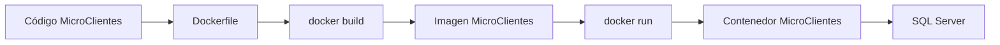

## 9.3 Actividades

* Revisar el Dockerfile.
* Configurar el puerto.
* Configurar variables de entorno.
* Configurar la cadena de conexión.
* Construir la imagen.
* Ejecutar el contenedor.
* Probar la API desde Postman.
* Validar acceso a SQL Server.
* Verificar publicación hacia RabbitMQ.

## 9.4 Comandos de referencia

```bash
docker build -t microclientes:1.0 .
```

```bash
docker run -d \
  --name microclientes-api \
  -p 8081:8080 \
  microclientes:1.0
```

---

# 10. Bloque 6 – Dockerización de MicroPedidos

## 10.1 Consideración importante

MicroPedidos tiene dos puntos de entrada:

```text
main_api.py
main_worker.py
```

La API y el Worker son procesos independientes.

Por esta razón, deben ejecutarse como dos contenedores o dos servicios diferentes, aunque utilicen la misma imagen Docker.

## 10.2 Arquitectura Docker de MicroPedidos

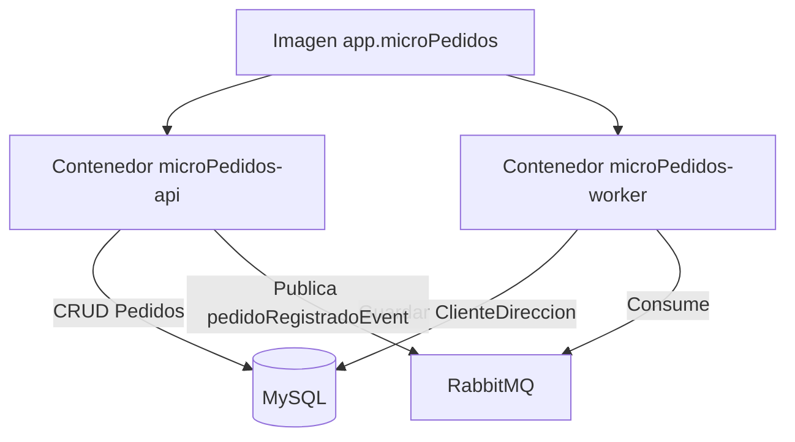

## 10.3 Contenedor API

Responsabilidad:

* Exponer FastAPI.
* Ejecutar `main_api.py`.
* Proteger endpoints con JWT.
* Registrar pedidos.
* Publicar `pedidoRegistradoEvent`.

Comando de ejecución interno:

```bash
uvicorn main_api:app --host 0.0.0.0 --port 8000
```

## 10.4 Contenedor Worker

Responsabilidad:

* Ejecutar `main_worker.py`.
* Escuchar RabbitMQ.
* Consumir `clienteDireccionEvent`.
* Guardar ClienteDireccion.

Comando de ejecución interno:

```bash
python main_worker.py
```

## 10.5 Construcción de imagen

```bash
docker build -t micropedidos:1.0 .
```

## 10.6 Ejecución del contenedor API

```bash
docker run -d \
  --name micropedidos-api \
  -p 8000:8000 \
  micropedidos:1.0
```

## 10.7 Ejecución del Worker

```bash
docker run -d \
  --name micropedidos-worker \
  micropedidos:1.0 \
  python main_worker.py
```

---

# 11. Bloque 7 – Integración con Docker Compose

## 11.1 Objetivo

Levantar los componentes mediante Docker Compose dentro de una misma red.

## 11.2 Servicios esperados

```text
microclientes-api
micropedidos-api
micropedidos-worker
sqlserver
mysql
rabbitmq
```

## 11.3 Arquitectura de contenedores

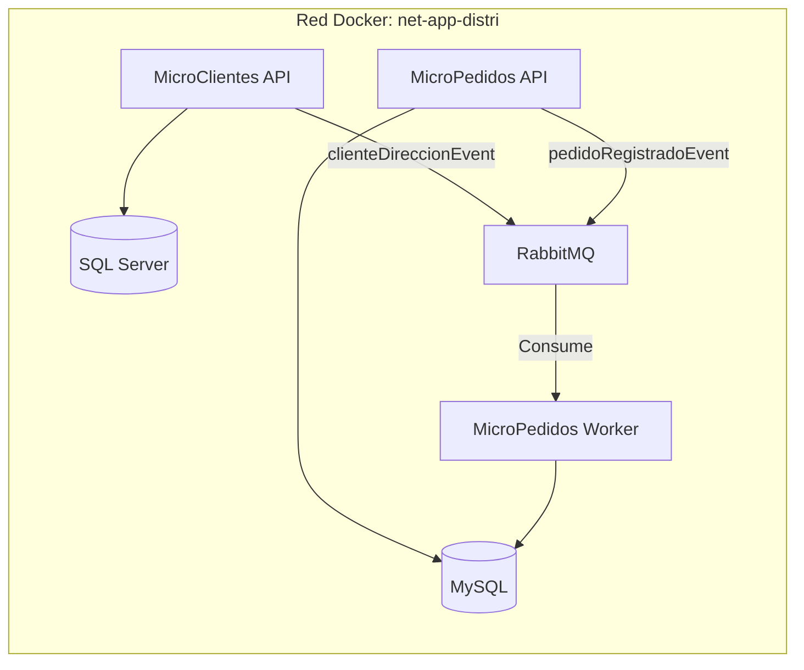

## 11.4 Conceptos que debe comprender el estudiante

* Imagen.
* Contenedor.
* Dockerfile.
* Docker Compose.
* Red Docker.
* Puerto interno.
* Puerto externo.
* Variables de entorno.
* Nombre del servicio.
* Persistencia mediante volúmenes.
* Dependencias entre servicios.

---

# 12. Bloque 8 – Pruebas con Postman

## 12.1 Objetivo

Crear una colección que permita probar MicroClientes y MicroPedidos en distintos ambientes sin modificar manualmente todas las URL.

## 12.2 Colección recomendada

```text
Proyecto Integrador
│
├── Seguridad
│   └── Login MicroPedidos
│
├── MicroClientes
│   ├── Listar clientes
│   ├── Consultar cliente
│   ├── Crear cliente
│   ├── Actualizar cliente
│   ├── Eliminar cliente
│   ├── Crear dirección
│   └── Listar direcciones
│
└── MicroPedidos
    ├── Listar pedidos
    ├── Consultar pedido
    ├── Crear pedido
    ├── Actualizar pedido
    └── Eliminar pedido
```

---

# 13. Bloque 9 – Ambientes en Postman

## 13.1 Objetivo

Configurar tres ambientes para consumir las APIs en diferentes escenarios:

* Local.
* Docker.
* Gateway.

## 13.2 Variables recomendadas

| Variable            | Descripción                   |
| ------------------- | ----------------------------- |
| `base_url_clientes` | URL base de MicroClientes     |
| `base_url_pedidos`  | URL base de MicroPedidos      |
| `token_pedidos`     | Token JWT                     |
| `cliente_id`        | Identificador del cliente     |
| `direccion_id`      | Identificador de la dirección |
| `pedido_id`         | Identificador del pedido      |

---

## 13.3 Ambiente Local

```text
base_url_clientes = https://localhost:7001
base_url_pedidos = http://localhost:8000
```

Ejemplo:

```http
{{base_url_clientes}}/api/clientes
```

```http
{{base_url_pedidos}}/pedidos
```

---

## 13.4 Ambiente Docker

```text
base_url_clientes = http://localhost:8081
base_url_pedidos = http://localhost:8000
```

---

## 13.5 Ambiente Gateway

Aunque Kong se consolidará en una etapa posterior, el ambiente debe quedar preparado:

```text
base_url_clientes = http://localhost:8001/clientes
base_url_pedidos = http://localhost:8001/pedidos
```

---

# 14. Guardar automáticamente el JWT en Postman

En la pestaña **Tests** de la solicitud de login:

```javascript
const token = pm.response.json();
pm.environment.set("token_pedidos", token);
```

En los endpoints protegidos:

```http
Authorization: Bearer {{token_pedidos}}
```

## Flujo en Postman

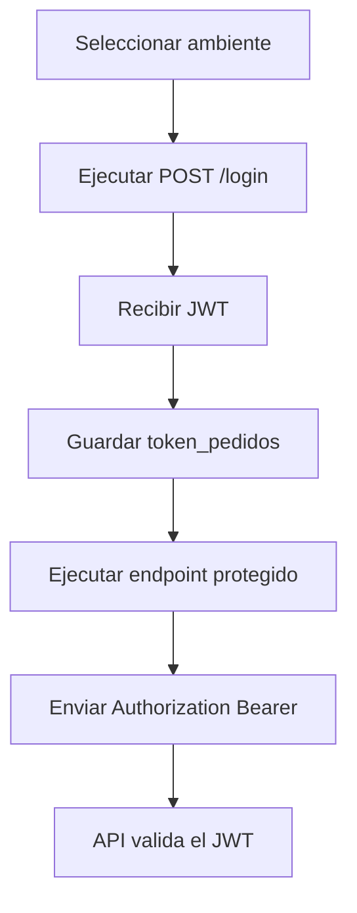

---

# 15. Bloque 10 – Docker Hub

## 15.1 ¿Qué es Docker Hub?

Docker Hub es un repositorio en línea para almacenar, compartir y descargar imágenes Docker.

Funciona de manera similar a GitHub, pero en lugar de almacenar código fuente, almacena imágenes de contenedores.

## 15.2 Usos principales

* Publicar imágenes Docker.
* Compartir imágenes con estudiantes o equipos.
* Descargar imágenes desde cualquier equipo.
* Automatizar despliegues.
* Versionar imágenes mediante tags.
* Usar imágenes dentro de Docker Compose.

## 15.3 Flujo de publicación

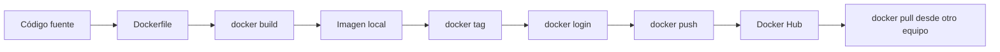

---

# 16. Publicar MicroClientes en Docker Hub

## 16.1 Iniciar sesión

```bash
docker login
```

## 16.2 Crear la imagen

```bash
docker build -t microclientes:1.0 .
```

## 16.3 Etiquetar la imagen

```bash
docker tag microclientes:1.0 usuarioDockerHub/microclientes:1.0
```

## 16.4 Publicar

```bash
docker push usuarioDockerHub/microclientes:1.0
```

---

# 17. Publicar MicroPedidos en Docker Hub

## 17.1 Crear la imagen

```bash
docker build -t micropedidos:1.0 .
```

## 17.2 Etiquetar

```bash
docker tag micropedidos:1.0 usuarioDockerHub/micropedidos:1.0
```

## 17.3 Publicar

```bash
docker push usuarioDockerHub/micropedidos:1.0
```

---

# 18. Descargar y probar las imágenes

```bash
docker pull usuarioDockerHub/microclientes:1.0
```

```bash
docker pull usuarioDockerHub/micropedidos:1.0
```

El estudiante deberá demostrar que puede ejecutar la solución utilizando las imágenes descargadas, sin volver a construirlas desde el código fuente.

---

# 19. Secuencia práctica de la clase

| N.° | Actividad                             | Resultado esperado                  |
| --: | ------------------------------------- | ----------------------------------- |
|   1 | Levantar SQL Server, MySQL y RabbitMQ | Infraestructura disponible          |
|   2 | Ejecutar MicroClientes                | API funcional                       |
|   3 | Ejecutar MicroPedidos API y Worker    | Dos entradas funcionando            |
|   4 | Registrar cliente y dirección         | Información persistida              |
|   5 | Verificar `clienteDireccionEvent`     | Evento publicado                    |
|   6 | Verificar consumo en MicroPedidos     | ClienteDireccion almacenado         |
|   7 | Obtener JWT mediante `/login`         | Token generado                      |
|   8 | Crear pedido protegido                | Pedido registrado                   |
|   9 | Calcular total                        | Total almacenado correctamente      |
|  10 | Publicar `pedidoRegistradoEvent`      | Evento disponible para MicroFactura |
|  11 | Dockerizar MicroClientes              | Imagen construida                   |
|  12 | Dockerizar MicroPedidos               | Imagen reutilizada por API y Worker |
|  13 | Crear colección Postman               | Endpoints organizados               |
|  14 | Crear ambientes                       | Local, Docker y Gateway             |
|  15 | Publicar imágenes                     | Imágenes disponibles en Docker Hub  |

---

# 20. Evidencias que debe presentar el estudiante

* Captura de MicroClientes ejecutándose.
* Captura de MicroPedidos API.
* Captura de MicroPedidos Worker.
* Captura del evento `clienteDireccionEvent`.
* Registro almacenado en MySQL.
* Login y token JWT.
* Endpoint rechazado sin token.
* Endpoint ejecutado con token.
* Pedido creado.
* Total calculado.
* Evento `pedidoRegistradoEvent`.
* Imágenes Docker locales.
* Contenedores ejecutándose.
* Ambientes Postman.
* Colección Postman.
* Repositorios de Docker Hub.
* Ejecución mediante imágenes descargadas.

---

# 21. Entregables de la Semana 3

| Entregable               | Descripción                                      |
| ------------------------ | ------------------------------------------------ |
| MicroPedidos funcional   | CRUD, cálculo del total y publicación del evento |
| JWT                      | Login y protección de endpoints                  |
| Dockerfile MicroClientes | Imagen funcional                                 |
| Dockerfile MicroPedidos  | Imagen utilizada por API y Worker                |
| Docker Compose           | Integración parcial                              |
| Colección Postman        | MicroClientes y MicroPedidos                     |
| Ambientes Postman        | Local, Docker y Gateway                          |
| Docker Hub               | Dos imágenes publicadas                          |
| Evidencias               | Capturas y explicación técnica                   |

---

# 22. Criterios de evaluación

| Criterio                                   | Porcentaje |
| ------------------------------------------ | ---------: |
| Registro y CRUD de pedidos                 |       15 % |
| Cálculo correcto del total                 |       10 % |
| Construcción de `PedidoRegistradoEventDto` |       10 % |
| Publicación de `pedidoRegistradoEvent`     |       10 % |
| Seguridad JWT                              |       15 % |
| Dockerización de MicroClientes             |       10 % |
| Dockerización de MicroPedidos              |       10 % |
| Colección y ambientes Postman              |       10 % |
| Publicación en Docker Hub                  |       10 % |
| **Total**                                  |  **100 %** |

---

# 23. Resultado final de la semana

Al finalizar la Semana 3, la arquitectura debe permitir el siguiente flujo:

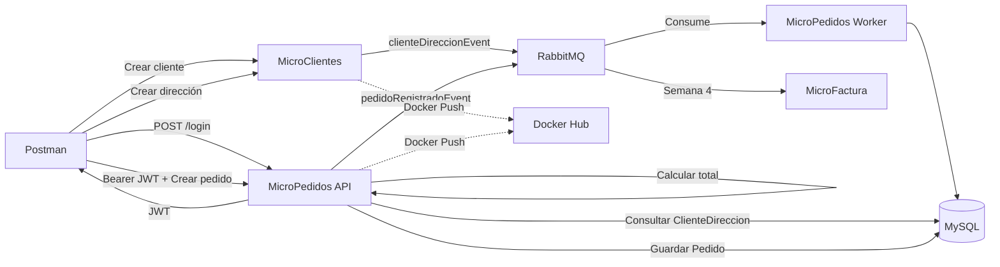

La Semana 3 consolida el proyecto integrador, ya que los estudiantes no solamente desarrollan los endpoints, sino que también aplican seguridad, mensajería, pruebas, contenerización y publicación de imágenes. Con ello, MicroClientes y MicroPedidos quedan listos para integrarse con MicroFactura en la siguiente semana.
